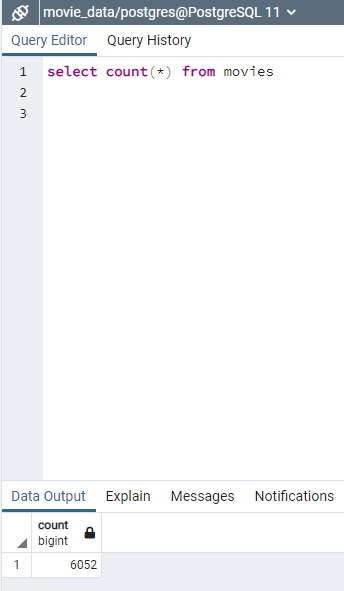
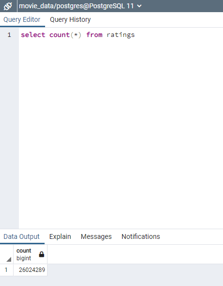

# Movies-ETL

## Extract/Transform/Load Wikipedia and Kaggle Movie Data
Amazing Prime video is a platform that streams movies and TV shows online, and the team at Amazing wants to predict which low budget movies being released will become hits, so they can buy the streaming rights.

Amazing prime has asked for a clean set of movie data for a hackathon that they are hosting, with the attempt to have participants to develop an algorithm to predict popular pictures. Datasets from Wikipedia for all movies released since 1990 and movie rating metadata from MovieLens, hosted on Kaggle needs to be extracted, and transformed into one clean data set. Once the data is clean, it will be loaded into a SQL table.

## Results

The movies table had a result of 6,052 rows of movie data after removing redundant or duplicate rows, and sorted, filtered and consolidated columns from two different sources. 

This was then successfully loaded onto a SQL table as seen below querying the count of rows:
### Figure 1 - Movies successfully loaded
</img>

The same was done for the Ratings data, which had a much larger dataset of 26,024,289 rows of data:
### Figure 2 - Ratings data successfully loaded
</img>

[Figure 1](#Figure-1---Movies-successfully-loaded)
[Figure 2](#Figure-2---Ratings-data-successfully-loaded)